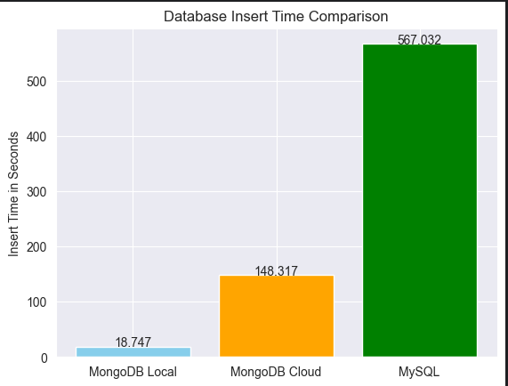
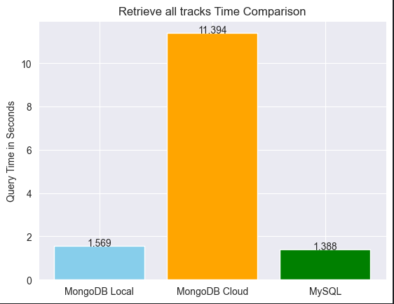
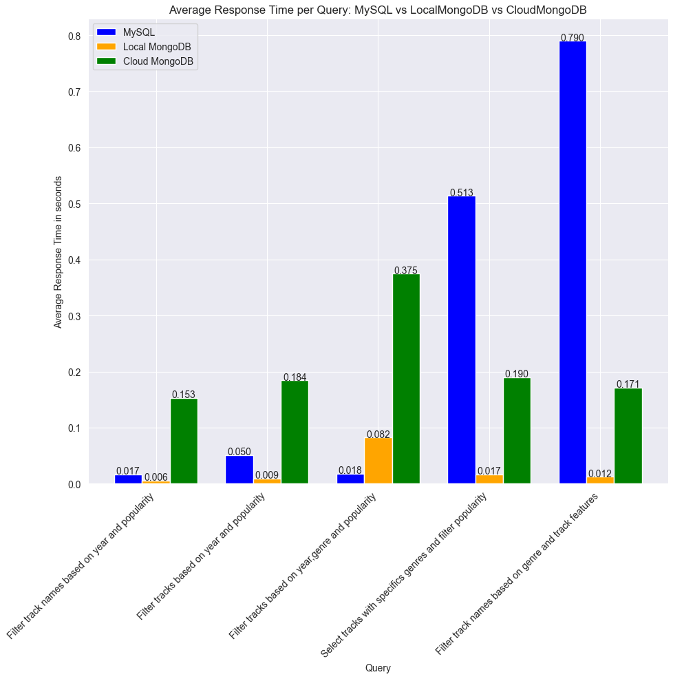
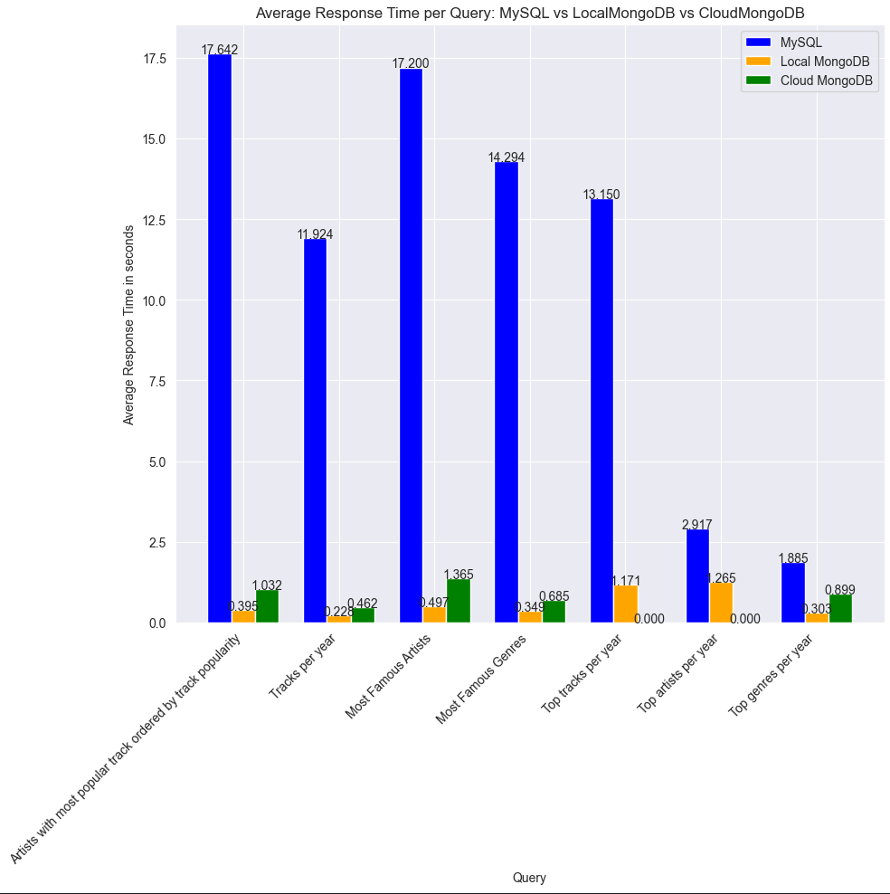

## 3 Results

Insert Performance


```python
databases = ['MongoDB Local', 'MongoDB Cloud', 'MySQL']
times = [LocalMongoDB_InsertTime, CloudMongoDB_InsertTime, MySQL_InsertTime]

plt.bar(databases, times, color=['skyblue', 'orange', 'green'])

plt.ylabel('Insert Time in Seconds')
plt.title('Database Insert Time Comparison')


for i, time_val in enumerate(times):
    plt.text(i, time_val + 0.001, f'{time_val:.3f}', ha='center')

plt.show()
```


    

    


```python

```

Query Tracks performance


```python
databases = ['MongoDB Local', 'MongoDB Cloud', 'MySQL']
times = [Local_MongoDB_allTracks, Cloud_MongoDB_allTracks, MySQL_alltracks]

plt.bar(databases, times, color=['skyblue', 'orange', 'green'])

plt.ylabel('Query Time in Seconds')
plt.title('Retrieve all tracks Time Comparison')


for i, time_val in enumerate(times):
    plt.text(i, time_val + 0.001, f'{time_val:.3f}', ha='center')

plt.show()
```


    

    


Count Tracks


```python
databases = ['MongoDB Local', 'MongoDB Cloud', 'MySQL']
times = [LocalMongoDB_Count, CloudMongoDB_Count, MySQL_Count]

plt.bar(databases, times, color=['skyblue', 'orange', 'green'])

plt.ylabel('Count Time in Seconds')
plt.title('Count Tracks Time Comparison')


for i, time_val in enumerate(times):
    plt.text(i, time_val + 0.001, f'{time_val:.3f}', ha='center')

plt.show()
```


    

    


Query Track Feature Performance


```python
databases = ['MongoDB Local', 'MongoDB Cloud', 'MySQL']
times = [LocalMongoDB_track_features, CloudMongoDB_track_features, MySQL_track_features]

plt.bar(databases, times, color=['skyblue', 'orange', 'green'])

plt.ylabel('Query Time in Seconds')
plt.title('Retrieve all Track Features Time Comparison')


for i, time_val in enumerate(times):
    plt.text(i, time_val + 0.001, f'{time_val:.3f}', ha='center')

plt.show()
```


    

    


Query All Data Performance


```python
databases = ['MongoDB Local', 'MongoDB Cloud', 'MySQL']
times = [Local_MongoDB_allData, Cloud_MongoDB_allData, MySQL_alldata]

plt.bar(databases, times, color=['skyblue', 'orange', 'green'])

plt.ylabel('Query Time in Seconds')
plt.title('Retrieve all Data Time Comparison')


for i, time_val in enumerate(times):
    plt.text(i, time_val + 0.001, f'{time_val:.3f}', ha='center')

plt.show()
```


    

    


Simple Queries Performance


```python
queries = ['Based on specific ID','Based on specific genre','Based on specific year','Based on specific genre and year','Based on specific artist','Based on specific artists','Tracks for specific artists','Track and name based on features']
mysql_times = [MySQL_Q11, MySQL_Q12, MySQL_Q13, MySQL_Q14, MySQL_Q15, MySQL_Q16, MySQL_Q17, MySQL_Q18]
localmongodb_times = [LocalMongoDB_Q11, LocalMongoDB_Q12, LocalMongoDB_Q13, LocalMongoDB_Q14, LocalMongoDB_Q15, LocalMongoDB_Q16, LocalMongoDB_Q17, LocalMongoDB_Q18]
cloudmongodb_times = [Cloud_MongoDB_Q11, Cloud_MongoDB_Q12, Cloud_MongoDB_Q13, Cloud_MongoDB_Q14, Cloud_MongoDB_Q15, Cloud_MongoDB_Q16, Cloud_MongoDB_Q17, Cloud_MongoDB_Q18]

x = np.arange(len(queries))
width = 0.25
plt.figure(figsize=(10,10))
plt.bar(x - width, mysql_times, width, label='MySQL', color='blue')
plt.bar(x, localmongodb_times, width, label='Local MongoDB', color='orange')
plt.bar(x + width, cloudmongodb_times, width, label='Cloud MongoDB', color='green')


plt.xticks(x, queries, rotation=45, ha='right')
plt.ylabel('Average Response Time in seconds')
plt.xlabel('Query')
plt.title('Average Response Time per Query: MySQL vs LocalMongoDB vs CloudMongoDB')
plt.legend()


for i, val in enumerate(mysql_times):
    plt.text(i - width, val + 0.001, f'{val:.3f}', ha='center')
for i, val in enumerate(localmongodb_times):
    plt.text(i, val + 0.001, f'{val:.3f}', ha='center')
for i, val in enumerate(cloudmongodb_times):
    plt.text(i + width, val + 0.001, f'{val:.3f}', ha='center')

plt.tight_layout()
plt.show()
```


    

    


```python

```

Filter Queries Performance


```python
queries = ['Filter track names based on year and popularity','Filter tracks based on year and popularity','Filter tracks based on year,genre and popularity','Select tracks with specifics genres and filter popularity','Filter track names based on genre and track features']
mysql_times = [MySQL_Q21, MySQL_Q22, MySQL_Q23, MySQL_Q24, MySQL_Q25]
localmongodb_times = [LocalMongoDB_Q21, LocalMongoDB_Q22, LocalMongoDB_Q23, LocalMongoDB_Q24, LocalMongoDB_Q25]
cloudmongodb_times = [Cloud_MongoDB_Q21, Cloud_MongoDB_Q22, Cloud_MongoDB_Q23, Cloud_MongoDB_Q24, Cloud_MongoDB_Q25]

x = np.arange(len(queries))
width = 0.25
plt.figure(figsize=(10,10))
plt.bar(x - width, mysql_times, width, label='MySQL', color='blue')
plt.bar(x, localmongodb_times, width, label='Local MongoDB', color='orange')
plt.bar(x + width, cloudmongodb_times, width, label='Cloud MongoDB', color='green')


plt.xticks(x, queries, rotation=45, ha='right')
plt.ylabel('Average Response Time in seconds')
plt.xlabel('Query')
plt.title('Average Response Time per Query: MySQL vs LocalMongoDB vs CloudMongoDB')
plt.legend()


for i, val in enumerate(mysql_times):
    plt.text(i - width, val + 0.001, f'{val:.3f}', ha='center')
for i, val in enumerate(localmongodb_times):
    plt.text(i, val + 0.001, f'{val:.3f}', ha='center')
for i, val in enumerate(cloudmongodb_times):
    plt.text(i + width, val + 0.001, f'{val:.3f}', ha='center')

plt.tight_layout()
plt.show()
```


    

    


```python

```

Range Queries Performance


```python
queries = ['Tracks between 2015 and 2020','Tracks between 2015 and 2017 in specific genres','Artist names for specific genre between 2020 and 2023','Artist names with filtered features between 2020 and 2023','Unique Artist with filtered features between 2020 and 2023']
mysql_times = [MySQL_Q31, MySQL_Q32, MySQL_Q33, MySQL_Q34, MySQL_Q35]
localmongodb_times = [LocalMongoDB_Q31, LocalMongoDB_Q32, LocalMongoDB_Q33, LocalMongoDB_Q34, LocalMongoDB_Q35]
cloudmongodb_times = [Cloud_MongoDB_Q31, Cloud_MongoDB_Q32, Cloud_MongoDB_Q33, Cloud_MongoDB_Q34, Cloud_MongoDB_Q35]

x = np.arange(len(queries))
width = 0.25
plt.figure(figsize=(10,10))
plt.bar(x - width, mysql_times, width, label='MySQL', color='blue')
plt.bar(x, localmongodb_times, width, label='Local MongoDB', color='orange')
plt.bar(x + width, cloudmongodb_times, width, label='Cloud MongoDB', color='green')


plt.xticks(x, queries, rotation=45, ha='right')
plt.ylabel('Average Response Time in seconds')
plt.xlabel('Query')
plt.title('Average Response Time per Query: MySQL vs LocalMongoDB vs CloudMongoDB')
plt.legend()


for i, val in enumerate(mysql_times):
    plt.text(i - width, val + 0.001, f'{val:.3f}', ha='center')
for i, val in enumerate(localmongodb_times):
    plt.text(i, val + 0.001, f'{val:.3f}', ha='center')
for i, val in enumerate(cloudmongodb_times):
    plt.text(i + width, val + 0.001, f'{val:.3f}', ha='center')

plt.tight_layout()
plt.show()
```


    

    


```python

```

Query Aggregations Performance


```python
queries = ['Artists with most popular track ordered by track popularity','Tracks per year','Most Famous Artists','Most Famous Genres','Top tracks per year','Top artists per year','Top genres per year']
mysql_times = [MySQL_Q41, MySQL_Q42, MySQL_Q43, MySQL_Q44, MySQL_Q45, MySQL_Q46, MySQL_Q47]
localmongodb_times = [LocalMongoDB_Q41, LocalMongoDB_Q42, LocalMongoDB_Q43, LocalMongoDB_Q44, LocalMongoDB_Q45, LocalMongoDB_Q46, LocalMongoDB_Q47]
cloudmongodb_times = [Cloud_MongoDB_Q41, Cloud_MongoDB_Q42, Cloud_MongoDB_Q43, Cloud_MongoDB_Q44, 0, 0, Cloud_MongoDB_Q47]

x = np.arange(len(queries))
width = 0.25
plt.figure(figsize=(10,10))
plt.bar(x - width, mysql_times, width, label='MySQL', color='blue')
plt.bar(x, localmongodb_times, width, label='Local MongoDB', color='orange')
plt.bar(x + width, cloudmongodb_times, width, label='Cloud MongoDB', color='green')


plt.xticks(x, queries, rotation=45, ha='right')
plt.ylabel('Average Response Time in seconds')
plt.xlabel('Query')
plt.title('Average Response Time per Query: MySQL vs LocalMongoDB vs CloudMongoDB')
plt.legend()


for i, val in enumerate(mysql_times):
    plt.text(i - width, val + 0.001, f'{val:.3f}', ha='center')
for i, val in enumerate(localmongodb_times):
    plt.text(i, val + 0.001, f'{val:.3f}', ha='center')
for i, val in enumerate(cloudmongodb_times):
    plt.text(i + width, val + 0.001, f'{val:.3f}', ha='center')

plt.tight_layout()
plt.show()
```


    

    


```python

```

## 4. Conclusions

- ***DISCLAIMER***. **For this comparisons designed queries are being used on both databases having equivalent logic. More queries could be used that could have different results that what were expected based on these results**

- To begin with, insert performance. During this comparison the time that is compared is only the time it takes to insert the data to the database. This comparison could not be repeated many times to take the average time but after performing 4 times the times for each database was close to the one displayed here. MongoDB insertion time is much faster than MySQL insertion and this is because of different reasons. First the MongoDB schema is very simple as all data are being saved in the same place and indexes can be created later while MySQL data must be separated and stored into 3 tables with indexes already being there and they must be updated for each row insert. Second MongoDB's flexible model allows to store large collection of documents faster through one request and then handles them in batches while for large collection of documents MySQL needs to insert them row by row. Third, MongoDB is also more relaxed about duplicated values while MySQL is more strict. This does not mean that MongoDB is a faster database than MySQL, it indicates that MongoDB can handle easier large collection of data even if the data used here is a sample of Big Data. Also the CloudMongoDB database is faster than MySQL but slower than the Local one due to network traffic and limited provided resources

- In MySQL there are three tables. Two of the are the main tables with most information, the table for tracks and the table for track features, the third table contains the artist and is used to connect the artists with their tracks. A comparison is being made to check the retrieval of these tables. Two comparisons, one for each of the main tables being retrieved separately and one comparison for retrieving all the data from all tables meaning there are joins. When retrieving data from only one table the two databases had the similar performance with MySQL being slightly better. The Cloud MongoDB database seemed to struggle in this case but this might be because of network traffic and less resources being used. But when all the data had to be retrieved meaning that MySQL needed to use joins, the difference in performance was very big. From having similar performance for single tables now MySQL needed on average almost 2 minutes while MongoDB would perform it in 4 seconds and as mentioned above this was caused because of MySQL using normalization and MongoDB denormalization, even Cloud MongoDB had better results with less resources.

- When the databases were compared for simple queries it is noticed that Cloud MongoDB was always worse from the other databases but this is expected. MongoDB and MySQL had similar performance except for two queries on genre and year. But in general we might think that the have similar performance for simple queries. (Might have differences in other queries for other attributes)

- When the databases were compared for filter queries it is noticed that MongoDB had similar performance with MySQL except from 2 queries from the queries tested, that were a bit more complex where MySQL had even worse response time than the Cloud MongoDB. From this we might think that MongoDB has better performance for more complex queries.

- When the databases were compared for range queries again it is noticed that MongoDB had similar performance with MySQL even with Cloud MongoDB except from 2 queries tested where MySQL had higher response time. For those 2 queries even MongoDB had increased response compared to the other queries which can indicate that both databases had more trouble for those queries. So we might think that they perform similar but MySQL struggles more when both databases struggle.

- When the databases were compared for aggregation queries the difference in performance was huge. MongoDB outperforms MySQL by huge margin. For these queries even Cloud MongoDB outperforms MySQL with limited resources, the only problem with Cloud MongoDB is that with the resources provided it couldnt perform specific queries.

- In general from this small comparison of using a sample for Big Data we conclude that MongoDB is much more suitable than MySQL to store Big Data, for most of the queries both perform relatively well but when it comes to aggregations, MongoDB performs them much better.

